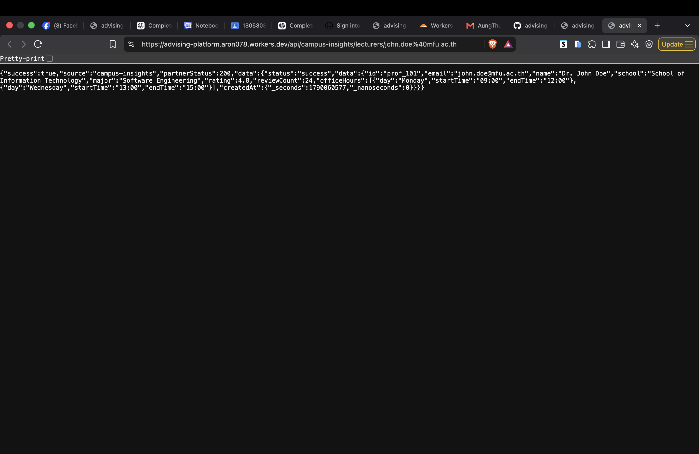

# A5 — Advising Platform × Campus Insights Integration Evidence

**Team:** Advising Platform

**Partner:** Campus Insights (Team 24)

**Production base URL:** `https://advising-platform.aron078.workers.dev`
**Evidence rule:** This report includes only results actually observed. A pending item is not represented as a successful integration.

## 1. Consumer Proof

**Purpose:** Advising Platform consumes lecturer information supplied by Campus Insights.

| Item | Evidence |
| --- | --- |
| Partner URL | `https://campus-insight-b9mp.onrender.com/api/v1/lecturers?email={lecturerEmail}` |
| Partner authentication | `x-api-key: CAMPUS_INSIGHTS_API_KEY` (stored as a Cloudflare secret; value omitted) |
| Our consumer endpoint | `GET /api/campus-insights/lecturers/:email` |
| Production request | `GET https://advising-platform.aron078.workers.dev/api/campus-insights/lecturers/john.doe%40mfu.ac.th` |
| Request time | 2026-09-22, approximately 10:52 UTC (terminal evidence) |
| Result | HTTP `200`; `success: true`; Campus Insights returned HTTP `200` |

Observed response body (non-secret fields):

```json
{
  "success": true,
  "source": "campus-insights",
  "partnerStatus": 200,
  "data": {
    "status": "success",
    "data": {
      "id": "prof_101",
      "email": "john.doe@mfu.ac.th",
      "name": "Dr. John Doe",
      "school": "School of Information Technology",
      "major": "Software Engineering",
      "rating": 4.8,
      "reviewCount": 24,
      "officeHours": [
        { "day": "Monday", "startTime": "09:00", "endTime": "12:00" },
        { "day": "Wednesday", "startTime": "13:00", "endTime": "15:00" }
      ]
    }
  }
}
```

**Screenshot evidence to submit:** terminal/browser response for the production request above.



## 2. Provider Proof

**Our provider endpoint:** `POST https://advising-platform.aron078.workers.dev/api/integration/provider-test`

It receives a raw JSON request, requires `X-Webhook-Signature`, verifies HMAC-SHA256 using `WEBHOOK_SECRET`, then stores a verified request in `integration_events` with source `provider-test`.

Existing D1 historical test record:

| event_id | event_type | source | status | created_at |
| --- | --- | --- | --- | --- |
| `a5-production-webhook-001` | `test.event` | `external-partner` | `processed` | `2026-09-21 17:59:46` |

**Partner confirmation:** pending an authenticated request from Campus Insights. This is not claimed as Campus Insights confirmation.

## 3. Webhook Receiver

**Receiver URL:** `POST https://advising-platform.aron078.workers.dev/api/webhooks/partner`

**Required headers:**

```text
Content-Type: application/json
X-Webhook-Signature: <HMAC-SHA256 hex of exact raw body using WEBHOOK_SECRET>
```

**Expected incoming payload:**

```json
{
  "eventId": "evt-campus-001",
  "eventType": "slot_booked",
  "lecturerEmail": "john.doe@mfu.ac.th",
  "bookedSlot": { "date": "2026-09-25", "time": "10:00-11:00" },
  "serverTimestamp": "2026-09-22T11:00:00.000Z"
}
```

**Verification behavior:** a valid signature is checked before parsing/trusting JSON and produces `signatureVerified: true`. Missing or invalid signatures return HTTP `401`. Verified events are stored in `integration_events` with their event ID, type, source, status, raw payload, and response metadata. No secret is stored.

**Real partner incoming delivery:** pending because Campus Insights has not supplied an inbound webhook signing implementation. The receiver is deployed and protected; it is deliberately not weakened for testing.

## 4. Webhook Sender

**Internal trigger:** `POST https://advising-platform.aron078.workers.dev/api/webhooks/send-test`

**Input used in Postman:**

```json
{
  "studentId": "student-001",
  "lecturerEmail": "john.doe@mfu.ac.th",
  "bookedSlot": {
    "date": "2026-09-25",
    "time": "10:00-11:00"
  }
}
```

**Target:** `POST https://campus-insight-b9mp.onrender.com/api/v1/webhooks/advising-event`

**Outgoing request:** Advising Platform adds a generated `eventId`, `eventType: "slot_booked"`, and ISO-8601 `serverTimestamp`; it sends Team 24's one agreed shared key in the required `x-signature` header. The key is stored as `CAMPUS_INSIGHTS_API_KEY` and is not exposed in this report.

**Observed sender result:**

| Item | Evidence |
| --- | --- |
| Postman result | HTTP `502 Bad Gateway` |
| Event ID shown in response | `slot-booked-07baf2bf-dd9d-41ad-ba48-1b9b55617750` |
| API result | `fallback: true`, `error: "Partner webhook request failed"` |
| Recovery | Manual retry after Team 24's endpoint is available; no automatic retry is implemented or claimed. |

Another production sender attempt at `2026-09-22T11:26:02Z` recorded event ID `slot-booked-8591cc22-af9b-4731-8a13-ace4140ba9d7` in D1 with source `advising-platform-sender` and status `failed`. The partner did not return a usable response before the Worker timeout. This proves the trigger, outgoing-event creation, and failure logging—not a successful partner receipt.

**Screenshot evidence to submit:** the Postman response showing the generated event ID and HTTP `502`.

## 5. Idempotency Proof

**Mechanism:** `integration_events.event_id` has a D1 `UNIQUE` constraint. The database, not only application memory, prevents duplicate event rows, including concurrent duplicate deliveries.

Use the identical signed payload twice:

```json
{
  "eventId": "evt-idempotency-001",
  "eventType": "slot_booked",
  "lecturerEmail": "john.doe@mfu.ac.th",
  "bookedSlot": { "date": "2026-09-25", "time": "10:00-11:00" },
  "serverTimestamp": "2026-09-22T11:00:00.000Z"
}
```

| Request | Expected verified response | Database result |
| --- | --- | --- |
| Request 1 | `duplicate: false` | One row is inserted for `evt-idempotency-001`. |
| Request 2 (same raw payload and signature) | `duplicate: true` | Still exactly one row because `event_id` is unique. |

Local automated test passed this exact flow: first signed delivery inserted one event, second signed delivery returned `duplicate: true`, and the test database contained one event. A real partner-signed production duplicate is pending Team 24's inbound webhook support.

## 6. Degradation Proof

**Breakage timestamp:** `2026-09-22T11:26:02Z` (production webhook-sender test).

**Fallback JSON returned to the caller:**

```json
{
  "success": false,
  "eventId": "slot-booked-8591cc22-af9b-4731-8a13-ace4140ba9d7",
  "source": "campus-insights",
  "fallback": true,
  "error": "Partner webhook request failed",
  "recovery": "Retry manually after the partner has recovered."
}
```

**Stored failure log:** D1 `integration_events` contains the same event ID with source `advising-platform-sender`, status `failed`, and created time `2026-09-22 11:26:12`.

**Additional safe fallback:** `GET /api/campus-insights/availability/prof_101?date=2026-09-25` returns HTTP `503` with `fallback: true` because Team 24 has not supplied an availability endpoint. No partner data is invented.

**Recovery behavior:** manual retry only. The Worker does not claim or implement automatic retry.

## Verification Summary

- `npm run typecheck`: passed.
- `npm test`: passed health, configuration fallback, HMAC verification, invalid-signature rejection, idempotency, mocked sender success, and sender failure handling.
- `wrangler deploy --dry-run`: passed.
- Production health endpoint: HTTP `200`.
- Production lecturer consumer endpoint: HTTP `200` with real Campus Insights data.
- Production webhook sender: controlled HTTP `502` and D1 failure log when Team 24's webhook did not provide a usable response.

## Screenshot Files for Submission

The following actual screenshots should be attached with this Markdown file. They contain no secrets.

| File | What it proves |
| --- | --- |
| `screenshots/a5-consumer-success.png` | Browser request to the deployed lecturer consumer endpoint returned `success: true`, partner status `200`, and Team 24 lecturer data. |
| `screenshots/a5-health.png` | Browser request to the deployed health endpoint returned `status: ok`. |
| `screenshots/a5-webhook-sender-fallback.png` | Postman sender test returned a generated event ID and controlled `502` fallback when the partner webhook did not return a usable response. |
| `screenshots/a5-integration-events.png` | Remote D1 query showing stored `integration_events` records, including sender failures. |

Health endpoint screenshot:


