# Assignment: Data and Query Design

## Advising Platform API

**Students:**

- Aung Thu Phyo — 6731503046
- Myat Soe Kaung — 67315030xx
- Nyi Min Htet — 67315030xx
- Liin Thit Oakkar — 67315030xx
- Myint Thwe Cho — 6731503069

**Program:** Bachelor of Engineering in Software Engineering <br>
**Database:** Cloudflare D1 <br>
**Backend:** Hono <br>
**Language:** TypeScript <br>

**Production API:**
https://advising-platform.advising-platform.workers.dev

---

## 1. Project Overview

The Advising Platform API is a REST API designed to manage student academic advising requests.

The system allows students to submit an advising request containing their student ID, agenda, preferred date, and preferred time. The backend stores these requests in a Cloudflare D1 database and provides REST API endpoints for creating, reading, updating, and deleting requests.

### System Architecture

```text
Client
   |
   | HTTP Request
   v
Cloudflare Workers
   |
   v
Hono REST API
   |
   | SQL Queries
   v
Cloudflare D1
   |
   v
advising_requests
```

---

# 2. Database Selection

## 2.1 Selected Database

The database selected for this project is **Cloudflare D1**.

The database is named:

```text
advising-db
```

The main table is:

```text
advising_requests
```

## 2.2 Why Cloudflare D1?

Cloudflare D1 was chosen because the backend API is deployed using Cloudflare Workers. D1 integrates directly with Workers through a database binding, making it convenient to connect the API to the database.

D1 is also a SQL-based relational database using SQLite. This is suitable for the Advising Platform because advising requests contain structured fields such as student ID, agenda, preferred date, preferred time, and status.

The main reasons for choosing D1 are:

- Direct integration with Cloudflare Workers
- SQL-based relational database
- Supports database migrations
- Supports standard CRUD operations
- Suitable for structured application data
- Does not require managing a separate database server
- Suitable for a small serverless API

---

# 3. Database Schema

The project uses one main table called `advising_requests`.

| Column           | Data Type | Constraint                  | Description                     |
| ---------------- | --------- | --------------------------- | ------------------------------- |
| `id`             | INTEGER   | PRIMARY KEY                 | Unique ID for each request      |
| `student_id`     | TEXT      | NOT NULL                    | Student ID                      |
| `agenda`         | TEXT      | NOT NULL                    | Purpose of the advising request |
| `preferred_date` | TEXT      | NOT NULL                    | Preferred advising date         |
| `preferred_time` | TEXT      | NOT NULL                    | Preferred advising time         |
| `status`         | TEXT      | NOT NULL, DEFAULT `pending` | Current request status          |
| `created_at`     | TEXT      | DEFAULT CURRENT_TIMESTAMP   | Request creation time           |
| `updated_at`     | TEXT      | DEFAULT CURRENT_TIMESTAMP   | Last update time                |

The `id` field uniquely identifies each advising request.

The `status` field defaults to `pending` when a new request is created.

The `created_at` and `updated_at` fields record when the request was created and updated.

---

# 4. Database Migration

The database schema was created using a Cloudflare D1 migration.

The migration file is:

```text
migrations/0001_create_advising_requests.sql
```

The migration creates the `advising_requests` table.

The database development process was:

```text
Create migration
      |
      v
Apply migration locally
      |
      v
Verify local schema
      |
      v
Build and test API
      |
      v
Apply migration to remote D1
      |
      v
Deploy Worker
      |
      v
Test production API
```

The local database was first used during development to avoid modifying the production database while developing.

The remote database was then updated before production testing.

---

# 5. ER Diagram

The project currently contains one main database table.

```text
+--------------------------------------+
|          advising_requests           |
+--------------------------------------+
| PK  id              INTEGER          |
|     student_id      TEXT             |
|     agenda          TEXT             |
|     preferred_date  TEXT             |
|     preferred_time  TEXT             |
|     status          TEXT             |
|     created_at      TEXT             |
|     updated_at      TEXT             |
+--------------------------------------+
```

**PK** means Primary Key.

Because this mini project currently uses one main table, there are no relationships between multiple entities.

> **ER Diagram Image:** Insert the ER diagram screenshot here if required by the submission.

---

# 6. API Design

The backend API was developed using Hono with TypeScript and deployed to Cloudflare Workers.

The API provides full CRUD operations for the `advising_requests` resource.

| Method | Endpoint                     | Operation | Description                   |
| ------ | ---------------------------- | --------- | ----------------------------- |
| POST   | `/api/advising-requests`     | Create    | Create a new advising request |
| GET    | `/api/advising-requests`     | Read All  | Retrieve all requests         |
| GET    | `/api/advising-requests/:id` | Read One  | Retrieve one request          |
| PATCH  | `/api/advising-requests/:id` | Update    | Update an existing request    |
| DELETE | `/api/advising-requests/:id` | Delete    | Delete a request              |

A health-check endpoint is also provided:

```text
GET /api/health
```

---

# 7. API Examples

## 7.1 Health Check

### Request

```bash
curl -i https://advising-platform.advising-platform.workers.dev/api/health
```

### Response

```text
HTTP/2 200
```

```json
{
  "status": "ok",
  "service": "advising-platform-api"
}
```

---

## 7.2 Create an Advising Request

### Request

```bash
curl -i -X POST https://advising-platform.advising-platform.workers.dev/api/advising-requests \
-H "Content-Type: application/json" \
-d '{
  "student_id": "6501234999",
  "agenda": "Discuss internship requirements",
  "preferred_date": "2026-08-28",
  "preferred_time": "13:00"
}'
```

### Response

```text
HTTP/2 201
```

```json
{
  "id": 3,
  "student_id": "6501234999",
  "agenda": "Discuss internship requirements",
  "preferred_date": "2026-08-28",
  "preferred_time": "13:00",
  "status": "pending"
}
```

The `201 Created` status indicates that the advising request was successfully created.

---

## 7.3 Read All Advising Requests

### Request

```bash
curl -i https://advising-platform.advising-platform.workers.dev/api/advising-requests
```

### Response

```text
HTTP/2 200
```

Example:

```json
[
  {
    "id": 3,
    "student_id": "6501234999",
    "agenda": "Discuss internship requirements",
    "preferred_date": "2026-08-28",
    "preferred_time": "13:00",
    "status": "pending"
  }
]
```

The `200 OK` status indicates that the requests were successfully retrieved.

---

## 7.4 Read One Advising Request

### Request

```bash
curl -i https://advising-platform.advising-platform.workers.dev/api/advising-requests/3
```

### Response

```text
HTTP/2 200
```

```json
{
  "id": 3,
  "student_id": "6501234999",
  "agenda": "Discuss internship requirements",
  "preferred_date": "2026-08-28",
  "preferred_time": "13:00",
  "status": "pending"
}
```

---

## 7.5 Update an Advising Request

### Request

```bash
curl -i -X PATCH https://advising-platform.advising-platform.workers.dev/api/advising-requests/3 \
-H "Content-Type: application/json" \
-d '{
  "status": "approved"
}'
```

### Response

```text
HTTP/2 200
```

```json
{
  "id": 3,
  "student_id": "6501234999",
  "agenda": "Discuss internship requirements",
  "preferred_date": "2026-08-28",
  "preferred_time": "13:00",
  "status": "approved"
}
```

The PATCH endpoint allows individual fields to be updated without replacing the entire resource.

---

## 7.6 Delete an Advising Request

### Request

```bash
curl -i -X DELETE https://advising-platform.advising-platform.workers.dev/api/advising-requests/3
```

### Response

```text
HTTP/2 204
```

The `204 No Content` response indicates that the request was successfully deleted.

---

# 8. Error Handling

The API also handles invalid requests and nonexistent resources.

## 8.1 Nonexistent Request

### Request

```bash
curl -i https://advising-platform.advising-platform.workers.dev/api/advising-requests/99999
```

### Response

```text
HTTP/2 404
```

```json
{
  "error": "Advising request not found"
}
```

---

## 8.2 Invalid Create Request

If required fields are missing, the API returns a `400 Bad Request` response.

### Example

```bash
curl -i -X POST https://advising-platform.advising-platform.workers.dev/api/advising-requests \
-H "Content-Type: application/json" \
-d '{
  "student_id": "6501234999"
}'
```

### Response

```text
HTTP/2 400
```

```json
{
  "error": "student_id, agenda, preferred_date, and preferred_time are required"
}
```

This validation prevents incomplete advising requests from being inserted into the database.

---

# 9. Production Deployment

The API was deployed to Cloudflare Workers.

Production API URL:

```text
https://advising-platform.advising-platform.workers.dev
```

The deployed Worker has access to the Cloudflare D1 database through the binding:

```text
env.advising_db
```

The production architecture is:

```text
Internet
   |
   v
Cloudflare Workers
   |
   | Hono API
   v
env.advising_db
   |
   v
Cloudflare D1
   |
   v
advising_requests
```

The deployment was successfully completed and the production API was tested using the public Workers URL.

---

# 10. Testing

The API was tested locally before production deployment.

The main testing sequence was:

```text
Health Check
     |
     v
POST - Create
     |
     v
GET - Read All
     |
     v
GET /:id - Read One
     |
     v
PATCH - Update
     |
     v
DELETE - Delete
     |
     v
Error Testing
```

The API returned the expected HTTP status codes:

| Test                | Expected Status |
| ------------------- | --------------: |
| Health check        |             200 |
| Create request      |             201 |
| Read all            |             200 |
| Read one            |             200 |
| Successful update   |             200 |
| Successful delete   |             204 |
| Invalid request     |             400 |
| Nonexistent request |             404 |

---

# 11. Evidence and Screenshots

The following screenshots demonstrate the implementation and testing of the project.

### Figure 1 — Remote D1 Database

Show the remote database containing the `advising_requests` table.
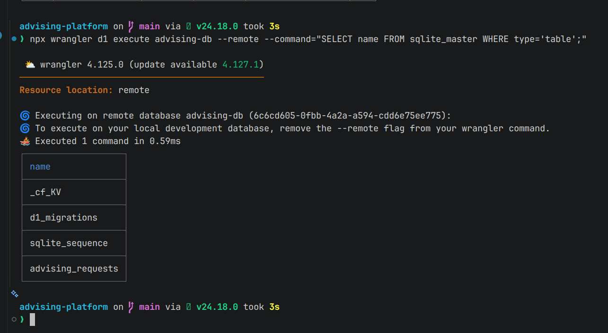

### Figure 2 — Database Schema

Show the columns of the `advising_requests` table.
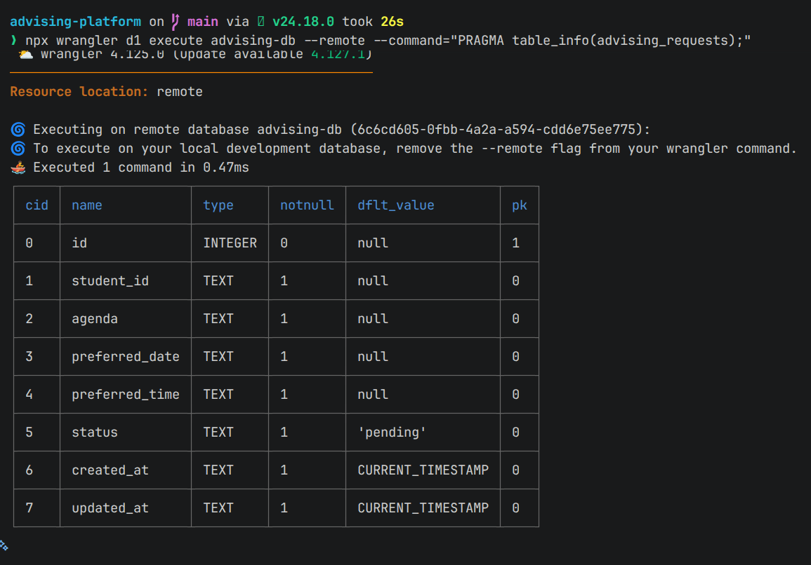

### Figure 3 — ER Diagram

Show the ER diagram for the database.
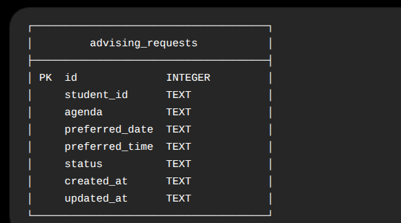

### Figure 4 — API Health Check

Show the production health endpoint returning HTTP 200.
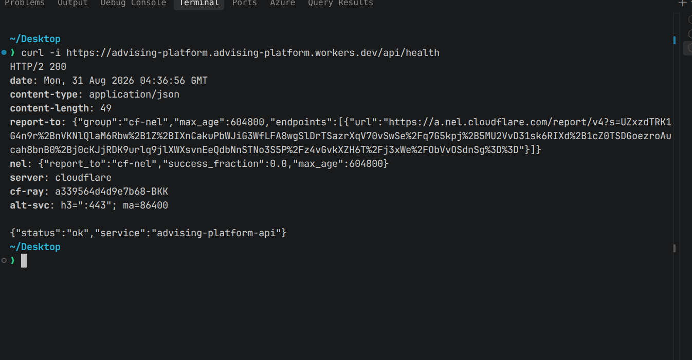

### Figure 5 — POST Request

Show the production API creating an advising request with HTTP 201.
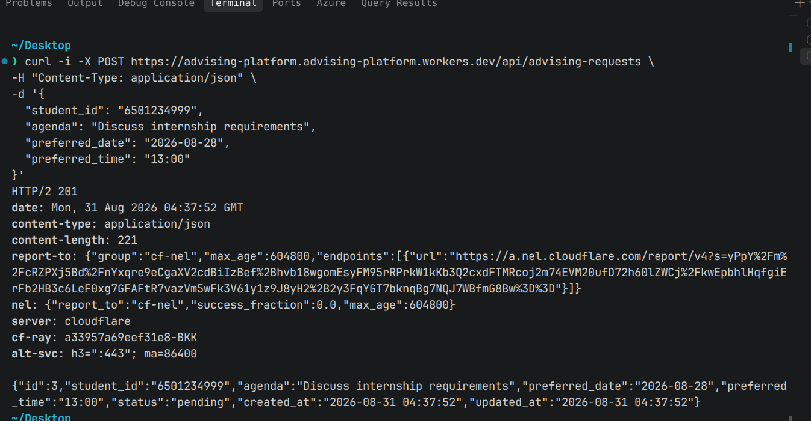

### Figure 6 — GET Request

Show the production API retrieving advising requests with HTTP 200.
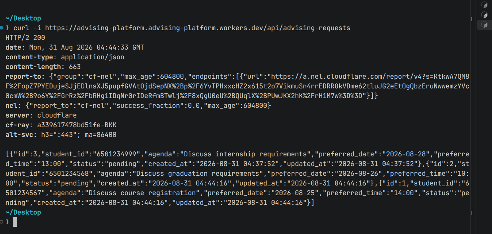

### Figure 7 — PATCH Request

Show the production API updating an advising request.
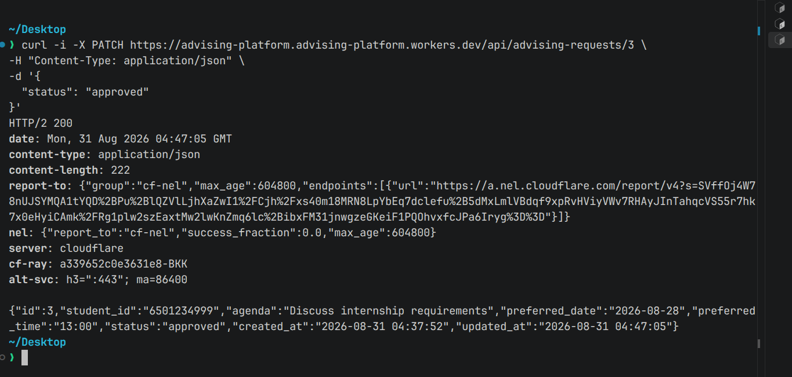

### Figure 8 — DELETE Request

Show the production API deleting an advising request with HTTP 204.
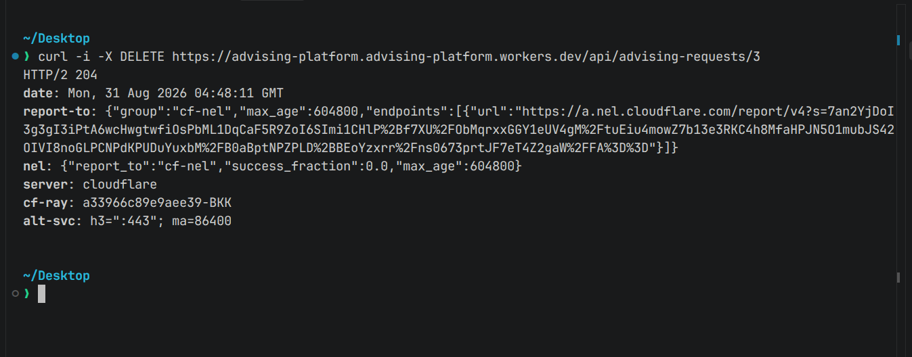

### Figure 9 — Error Handling

Show the API returning HTTP 400 or 404 for an invalid request.
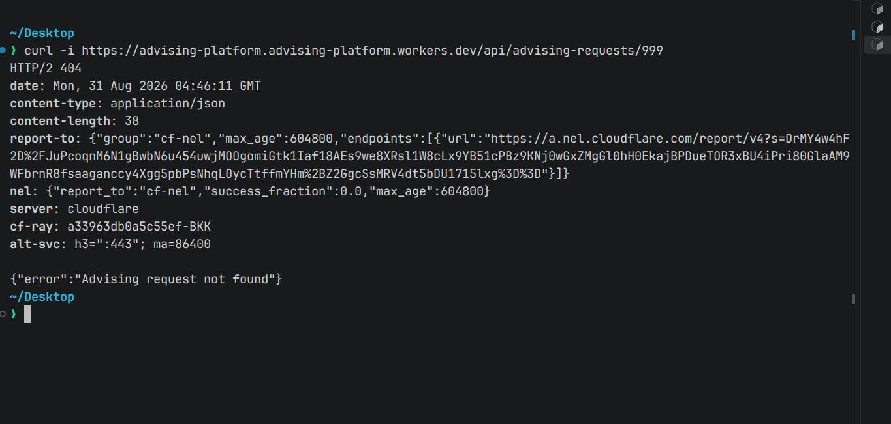

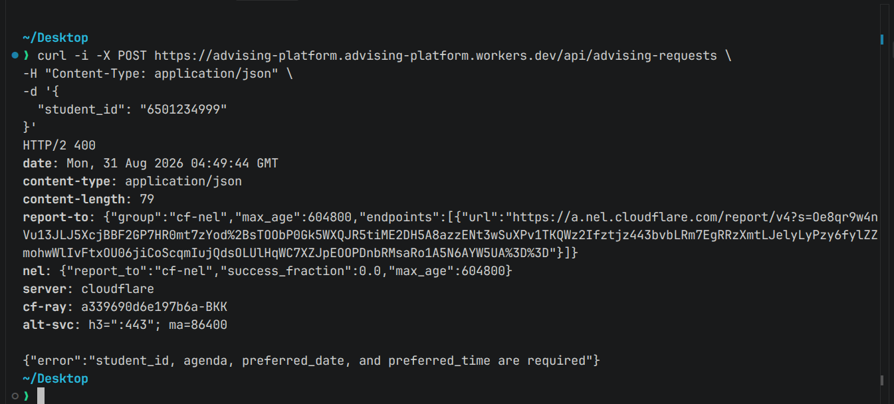

### Figure 10 — Cloudflare Deployment

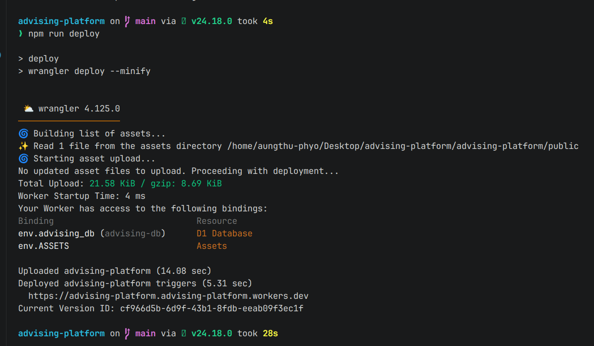

---

# 12. Conclusion

The Advising Platform API demonstrates how a relational database can be designed and accessed through a REST API.

Cloudflare D1 was used to store structured advising request data, while Hono and TypeScript were used to implement the API on Cloudflare Workers.

The project successfully implements full CRUD operations:

```text
Create  -> POST
Read    -> GET
Update  -> PATCH
Delete  -> DELETE
```

The database was migrated from the development environment to the remote D1 database, and the API was deployed to Cloudflare Workers.

The final production API is publicly accessible at:

```text
https://advising-platform.advising-platform.workers.dev
```

This project provided practical experience with database schema design, SQL queries, migrations, REST API development, HTTP status codes, local and remote databases, and cloud deployment.
